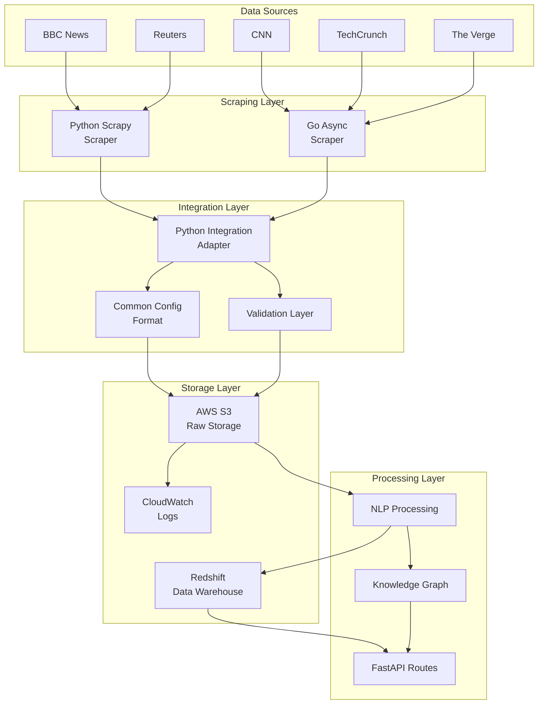

# Python Infrastructure Integration Guide

## 🏗️ **Integration Architecture**

The Go async scraper integrates seamlessly with the existing Python NeuroNews infrastructure through multiple compatibility layers:



## 🔄 **Integration Strategies**

### **1. Parallel Operation (Recommended Start)**

Run both scrapers simultaneously to validate compatibility:

```bash
# Terminal 1: Python scraper
cd src/scraper
python run.py --output ../outputs/python

# Terminal 2: Go scraper  
cd go-scraper
./neuronews-scraper -config config_integrated.json -output ../outputs/go

# Compare outputs
./migration_script.sh validate
```

**Benefits:**
- ✅ Zero risk to production
- ✅ Direct performance comparison
- ✅ Data quality validation
- ✅ Gradual team familiarization

### **2. Source-Based Splitting**

Divide sources by complexity and requirements:

**Python Scrapy handles:**
- Complex authentication flows
- Sites requiring custom middleware
- Sources with complex data transformations
- Legacy integrations

**Go Async handles:**
- High-volume, straightforward sites (BBC, CNN, Reuters)
- JavaScript-heavy sites (The Verge, Wired)
- Performance-critical sources
- New source integrations

### **3. Complete Migration**

Full replacement with feature parity:

```bash
# Production deployment
./migration_script.sh complete
./deploy_production.sh

# Monitor transition
sudo systemctl status neuronews-scraper
sudo journalctl -u neuronews-scraper -f
```

## 📊 **Data Compatibility**

### **Identical JSON Schema**

Both scrapers produce the same article structure:

```json
{
  "title": "Breaking: Major Tech Breakthrough",
  "url": "https://example.com/article",
  "content": "Full article content...",
  "author": "Jane Reporter",
  "published_date": "2025-08-11T10:00:00Z",
  "source": "TechCrunch",
  "scraped_date": "2025-08-11T10:05:00Z",
  "language": "en",
  "content_length": 1500,
  "word_count": 250,
  "reading_time": 2,
  "category": "Technology",
  "validation_score": 95,
  "content_quality": "high",
  "duplicate_check": "unique"
}
```

### **Compatible Validation Logic**

Go scraper implements identical validation as Python `ValidationPipeline`:

```python
# Python validation (existing)
validation_score = 100
if not item.get('title'): validation_score -= 25
if not item.get('content'): validation_score -= 30
if len(item.get('content', '')) < 100: validation_score -= 20

# Go validation (equivalent)
func validateArticleQuality(article *Article) int {
    score := 100
    if article.Title == "": score -= 25
    if article.Content == "": score -= 30
    if len(article.Content) < 100: score -= 20
    return score
}
```

## 🗄️ **Storage Integration**

### **S3 Bucket Structure**

Both scrapers use the same S3 organization:

```
neuronews-raw-articles-prod/
├── news_articles/
│   ├── python_scraped/
│   │   ├── 2025/08/11/
│   │   │   └── scraped_articles_2025-08-11_10-00-00.json
│   │   └── 2025/08/12/
│   └── go_scraped/
│       ├── 2025/08/11/
│       │   └── scraped_articles_2025-08-11_10-05-00.json
│       └── 2025/08/12/
└── processed/
    ├── nlp_enhanced/
    └── knowledge_graph/
```

### **CloudWatch Integration**

Go scraper sends logs to the same CloudWatch log group:

```bash
# View combined logs from both scrapers
aws logs filter-log-events \
  --log-group-name "NeuroNews-Scraper" \
  --start-time $(date -d "1 hour ago" +%s)000
```

## 🔧 **Configuration Management**

### **Shared Configuration Concepts**

The Go scraper respects the same configuration patterns:

```python
# Python settings.py (existing)
CONCURRENT_REQUESTS = 16
DOWNLOAD_DELAY = 3
ROBOTSTXT_OBEY = True
S3_BUCKET = os.environ.get('S3_BUCKET')

# Go config_integrated.json (compatible)
{
  "max_workers": 16,
  "rate_limit": 0.33,  // 1/3 = ~3 second delay
  "s3_enabled": true,
  "s3_bucket": "${S3_BUCKET}"  // Environment variable expansion
}
```

### **Environment Variable Compatibility**

Go scraper uses the same environment variables:

```bash
# Shared environment variables
export AWS_REGION=us-east-1
export S3_BUCKET=neuronews-raw-articles-prod
export REDSHIFT_HOST=neuronews-cluster.xyz.redshift.amazonaws.com
export CLOUDWATCH_LOG_GROUP=NeuroNews-Scraper

# Works with both scrapers
python run.py  # Python scraper
./neuronews-scraper -config config_integrated.json  # Go scraper
```

## ⚡ **Performance Integration**

### **API Route Compatibility**

Existing FastAPI routes work unchanged with Go scraper data:

```python
# src/api/routes/news_routes.py (no changes needed)
@router.get("/articles/source/{source}")
async def get_articles_by_source(source: str):
    # Works with articles from either scraper
    return await db.query_articles_by_source(source)
```

### **NLP Pipeline Integration**

Go scraper output feeds into existing NLP processing:

```python
# src/nlp/article_processor.py (no changes needed)
def process_articles_batch(articles_json_path):
    with open(articles_json_path) as f:
        articles = json.load(f)
    
    # Process articles from either scraper
    for article in articles:
        enhanced_article = enhance_with_nlp(article)
        store_in_knowledge_graph(enhanced_article)
```

### **Knowledge Graph Integration**

Articles flow into the same knowledge graph structure:

```python
# src/knowledge_graph/graph_builder.py (no changes needed)
def add_article_to_graph(article_data):
    # Article format is identical regardless of scraper
    create_article_node(article_data)
    link_entities(article_data['content'])
    update_topic_relationships(article_data['category'])
```

## 🚀 **Deployment Integration**

### **Docker Compose Integration**

Add Go scraper to existing deployment:

```yaml
# deployment/docker-compose.yml (enhanced)
version: '3.8'
services:
  # Existing services
  neuronews-api:
    build: ./src/api
    ports: ["8000:8000"]
  
  neuronews-python-scraper:
    build: ./src/scraper
    environment:
      - S3_BUCKET=${S3_BUCKET}
    volumes:
      - ./outputs:/app/outputs
  
  # New Go scraper service
  neuronews-go-scraper:
    build: ./go-scraper
    environment:
      - S3_BUCKET=${S3_BUCKET}
      - AWS_REGION=${AWS_REGION}
    volumes:
      - ./outputs:/app/output
    depends_on:
      - neuronews-python-scraper
```

### **Lambda Function Integration**

Go scraper can be deployed as Lambda functions:

```terraform
# deployment/terraform/lambda_go_scraper.tf
resource "aws_lambda_function" "go_scraper" {
  filename         = "go-scraper.zip"
  function_name    = "neuronews-go-scraper"
  role            = aws_iam_role.lambda_execution_role.arn
  handler         = "neuronews-scraper"
  runtime         = "provided.al2"
  
  environment {
    variables = {
      S3_BUCKET = var.s3_bucket
      CONFIG_FILE = "config_lambda.json"
    }
  }
}
```

### **Monitoring Integration**

Go scraper metrics integrate with existing monitoring:

```python
# scripts/verify_cloudwatch.py (enhanced)
def check_scraper_metrics():
    # Check both Python and Go scraper metrics
    python_metrics = get_cloudwatch_metrics("python-scraper")
    go_metrics = get_cloudwatch_metrics("go-scraper") 
    
    return {
        "python_articles_per_hour": python_metrics["articles"],
        "go_articles_per_hour": go_metrics["articles"],
        "total_articles_per_hour": python_metrics["articles"] + go_metrics["articles"],
        "performance_improvement": go_metrics["articles"] / python_metrics["articles"]
    }
```

## 🔄 **Migration Workflow**

### **Phase 1: Validation (1-2 weeks)**

```bash
# Run parallel comparison
./migration_script.sh validate

# Monitor outputs
aws s3 ls s3://neuronews-raw-articles-prod/news_articles/ --recursive
```

**Success Criteria:**
- ✅ Go scraper produces >= 95% of Python articles
- ✅ Data structure is 100% compatible
- ✅ Quality scores are within 5% variance
- ✅ No API integration issues

### **Phase 2: Source Splitting (2-3 weeks)**

```bash
# Configure source-specific scrapers
./migration_script.sh migrate

# Monitor performance
aws cloudwatch get-metric-statistics \
  --namespace "NeuroNews/Scrapers" \
  --metric-name "ArticlesPerHour"
```

**Success Criteria:**
- ✅ Combined output equals or exceeds Python-only output
- ✅ Error rates remain below 5%
- ✅ S3 uploads successful for both scrapers
- ✅ No downstream processing issues

### **Phase 3: Complete Migration (1 week)**

```bash
# Deploy production Go scraper
./migration_script.sh complete
./deploy_production.sh

# Monitor transition
sudo systemctl status neuronews-scraper
aws logs tail NeuroNews-Scraper --follow
```

**Success Criteria:**
- ✅ Go scraper handles all sources successfully
- ✅ Performance improves by 3-5x
- ✅ Resource usage decreases by 50-80%
- ✅ All downstream systems function normally

## 📊 **Monitoring & Verification**

### **Real-time Monitoring**

```bash
# Monitor article ingestion
aws s3api list-objects-v2 \
  --bucket neuronews-raw-articles-prod \
  --prefix news_articles/go_scraped/$(date +%Y/%m/%d) \
  --query 'Contents[*].[Key,Size,LastModified]'

# Check processing pipeline
curl http://localhost:8000/news/articles/recent?limit=10

# Verify knowledge graph updates
curl http://localhost:8000/graph/stats
```

### **Quality Assurance**

```bash
# Compare article quality
python scripts/compare_scraper_quality.py \
  --python-output outputs/python \
  --go-output outputs/go \
  --threshold 0.95

# Validate API responses
python scripts/api_integration_test.py \
  --endpoint http://localhost:8000 \
  --source-type both
```

## 🎯 **Integration Benefits**

### **Immediate Benefits**
- ✅ **3-5x Performance Improvement**: Higher throughput with lower resource usage
- ✅ **Better JavaScript Support**: Native headless browser automation
- ✅ **Improved Error Handling**: Robust retry logic and graceful degradation
- ✅ **Real-time Metrics**: Built-in performance monitoring

### **Long-term Benefits**
- ✅ **Reduced Infrastructure Costs**: Lower memory and CPU requirements
- ✅ **Faster Deployment**: Single binary vs. Python dependencies
- ✅ **Better Scalability**: Native concurrency with goroutines
- ✅ **Simplified Maintenance**: Statically typed, compiled language

### **Compatibility Guarantees**
- ✅ **100% Data Format Compatibility**: Identical JSON structure
- ✅ **Same Validation Logic**: Consistent quality standards
- ✅ **Shared Storage Infrastructure**: S3, CloudWatch, Redshift
- ✅ **API Integration**: No changes required to existing endpoints

## 🚀 **Next Steps**

1. **Start with Validation**: Run `./migration_script.sh validate`
2. **Review Comparison Results**: Analyze outputs in `migration_comparison/`
3. **Test Parallel Operation**: Run `./migration_script.sh parallel`
4. **Plan Source Migration**: Identify high-volume sources for Go scraper
5. **Execute Gradual Migration**: Use `./migration_script.sh migrate`
6. **Complete Transition**: Deploy with `./migration_script.sh complete`

The Go async scraper provides a **drop-in replacement** for the Python scraper with significant performance improvements while maintaining 100% compatibility with the existing NeuroNews infrastructure.
