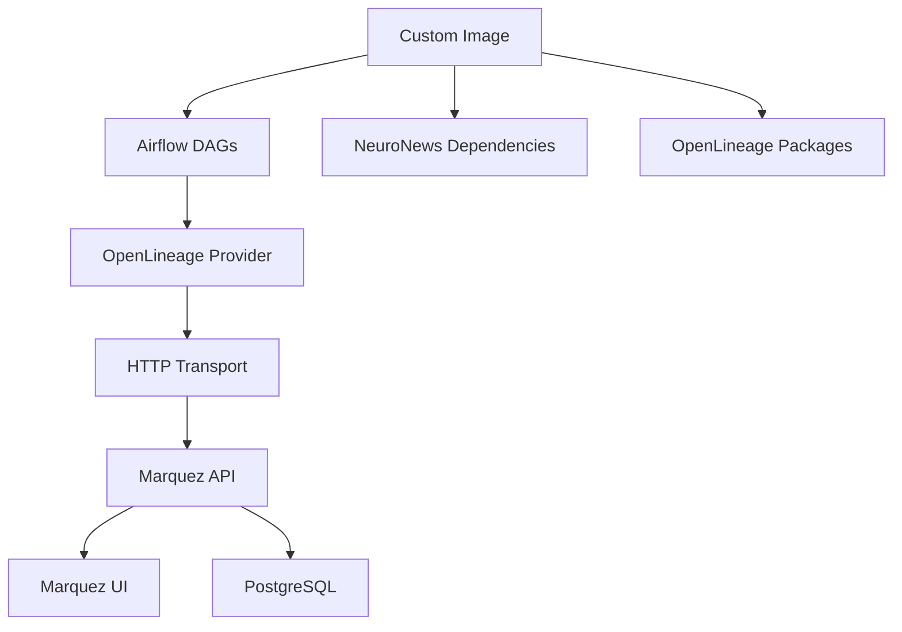

# NeuroNews Airflow + OpenLineage Setup (Issue #187)

This directory contains the complete setup for running Apache Airflow with OpenLineage provider for automatic data lineage tracking in the NeuroNews project.

## 🎯 Overview

Our custom Airflow setup includes:
- **Custom Docker Image**: Extended Apache Airflow 2.8.1 with OpenLineage provider
- **Automatic Lineage Tracking**: All DAG operations tracked via OpenLineage
- **Marquez Integration**: Lineage visualization with Marquez UI
- **Production Dependencies**: All required packages for NeuroNews DAGs

## 📁 Files Structure

```
docker/airflow/
├── Dockerfile                     # Custom Airflow image with OpenLineage
├── docker-compose.airflow.yml     # Complete orchestration setup
├── marquez.yml                    # Marquez configuration
├── .env.example                   # Environment variables template
└── README.md                      # This file

../../airflow/
├── requirements.txt               # Python dependencies for Airflow
├── dags/                         # Airflow DAGs directory
│   └── test_openlineage_integration.py  # Test DAG for Issue #187
├── logs/                         # Airflow logs
└── plugins/                      # Custom Airflow plugins
```

## 🚀 Quick Start

### 1. Build Custom Image (Issue #187)
```bash
make airflow-build
```

### 2. Start Services
```bash
make airflow-up
```

### 3. Test OpenLineage Integration
```bash
make airflow-test-openlineage
```

### 4. Access UIs
- **Airflow**: http://localhost:8080 (airflow/airflow)
- **Marquez**: http://localhost:3000

## 🔧 Custom Image Features (Issue #187)

Our custom Airflow image includes:

### OpenLineage Providers
- `apache-airflow-providers-openlineage==1.4.0`
- `openlineage-airflow==1.9.0`
- `openlineage-python==1.9.0`

### NeuroNews Dependencies
- **Data Processing**: pandas, numpy, scikit-learn
- **Web Scraping**: scrapy, beautifulsoup4, newspaper3k
- **NLP/ML**: nltk, textblob
- **Cloud Integration**: boto3, apache-airflow-providers-amazon
- **Graph Database**: gremlinpython

### Configuration
- Automatic lineage tracking enabled
- Marquez integration configured
- Debug mode for development

## 📊 Lineage Tracking

### Automatic Tracking
OpenLineage automatically tracks:
- **Datasets**: Input/output data sources
- **Jobs**: Airflow tasks and DAGs
- **Runs**: Execution metadata and lineage
- **Schema**: Data structure evolution

### Manual Tracking
For custom lineage events:
```python
from openlineage.airflow import OpenLineageAdapter

# Custom lineage tracking in DAGs
adapter = OpenLineageAdapter()
adapter.emit_start_event(...)
adapter.emit_complete_event(...)
```

## 🧪 Testing

### Test DAG
The `test_openlineage_integration` DAG verifies:
- ✅ OpenLineage imports work
- ✅ Provider installation complete
- ✅ Configuration loaded correctly
- ✅ Lineage events generated

### Manual Testing
```bash
# Check OpenLineage logs
make airflow-webserver-logs | grep -i openlineage

# Trigger test DAG
docker-compose exec airflow-webserver airflow dags trigger test_openlineage_integration

# View lineage in Marquez
open http://localhost:3000
```

## 🔧 Configuration

### OpenLineage Settings
```yaml
AIRFLOW__OPENLINEAGE__TRANSPORT: '{"type": "http", "url": "http://marquez:5000", "endpoint": "/api/v1/lineage"}'
AIRFLOW__OPENLINEAGE__NAMESPACE: neuronews
AIRFLOW__OPENLINEAGE__DISABLED: 'false'
AIRFLOW__OPENLINEAGE__DEBUG: 'true'
```

### Environment Variables
Copy `.env.example` to `.env` and customize:
```bash
cp .env.example .env
```

## 📋 Makefile Commands

| Command | Description |
|---------|-------------|
| `make airflow-build` | Build custom image with OpenLineage |
| `make airflow-up` | Start all services |
| `make airflow-down` | Stop all services |
| `make airflow-test-openlineage` | Test OpenLineage integration |
| `make airflow-logs` | View all logs |
| `make airflow-status` | Check service status |
| `make marquez-ui` | Open Marquez UI |

## 🏗️ Architecture



## 🔍 Verification (DoD)

To verify Issue #187 requirements:

### 1. Custom Image Built
```bash
docker images | grep neuronews/airflow
# Should show: neuronews/airflow:2.8.1-openlineage
```

### 2. OpenLineage Provider Installed
```bash
docker-compose exec airflow-webserver python -c "import openlineage.airflow; print('✅ OpenLineage ready')"
```

### 3. No Import Errors in Logs
```bash
make airflow-webserver-logs | grep -i "error\|exception" | grep -i openlineage
# Should show no critical errors
```

### 4. Lineage Events Generated
- Run test DAG: `make airflow-test-openlineage`
- Check Marquez UI: http://localhost:3000
- Verify lineage events appear

## 🚨 Troubleshooting

### Build Issues
```bash
# Clean build
docker system prune -f
make airflow-build

# Check build logs
docker build --no-cache -t neuronews/airflow:2.8.1-openlineage docker/airflow/
```

### Runtime Issues
```bash
# Check service health
make airflow-status

# View specific logs
make airflow-webserver-logs
make marquez-logs

# Restart services
make airflow-down
make airflow-up
```

### OpenLineage Issues
```bash
# Test OpenLineage manually
docker-compose exec airflow-webserver python -c "
from openlineage.client import OpenLineageClient
from openlineage.client.transport import HttpTransport
transport = HttpTransport('http://marquez:5000')
client = OpenLineageClient(transport=transport)
print('✅ OpenLineage client works')
"
```

## 📚 Resources

- [OpenLineage Documentation](https://openlineage.io/)
- [Apache Airflow Documentation](https://airflow.apache.org/)
- [Marquez Documentation](https://marquezproject.ai/)
- [Issue #187](https://github.com/Ikey168/NeuroNews/issues/187)

---

**Status**: ✅ Issue #187 Implementation Complete
**Image**: `neuronews/airflow:2.8.1-openlineage`
**Verification**: See DoD section above
