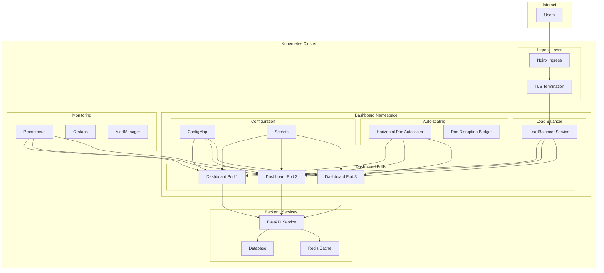

# NeuroNews Dashboard Kubernetes Deployment

## Overview

The NeuroNews Dashboard is a comprehensive Streamlit-based web application that provides real-time visualization and insights for news data. This deployment guide covers the complete Kubernetes setup with auto-scaling, monitoring, security, and real-time updates.

## Architecture



## Features

### Core Dashboard Features
- **Real-time News Visualization**: Live updates of news trends and analytics
- **Interactive Data Exploration**: Dynamic filtering, searching, and visualization
- **Entity Relationship Mapping**: Visual representation of news entity connections
- **Sentiment Analysis Dashboard**: Real-time sentiment tracking and trends
- **Multi-language Support**: Content analysis across multiple languages
- **Responsive Design**: Mobile-friendly interface

### Kubernetes Features
- **High Availability**: Multi-replica deployment with session affinity
- **Auto-scaling**: HPA with CPU/memory metrics and custom dashboard metrics
- **Load Balancing**: Session-aware load balancing for Streamlit
- **Real-time Updates**: WebSocket support for live data updates
- **SSL Termination**: HTTPS with automatic certificate management
- **Security**: RBAC, NetworkPolicies, and security contexts
- **Monitoring**: Prometheus metrics and Grafana dashboards
- **Resource Management**: Resource quotas and limits

## Prerequisites

### Kubernetes Cluster Requirements
- Kubernetes 1.19+
- Minimum 3 worker nodes
- 8 vCPUs total, 16GB RAM total
- Storage class for persistent volumes
- Ingress controller (Nginx recommended)

### Optional Components
- **Prometheus Operator**: For monitoring and alerting
- **Grafana**: For dashboard visualization
- **Cert-Manager**: For automatic SSL certificate management
- **External DNS**: For automatic DNS management

### Required Tools
- `kubectl` 1.19+
- `helm` 3.0+ (if using Helm charts)
- Access to container registry with dashboard image

## Quick Start

### 1. Deploy with Script
```bash
# Basic deployment
./scripts/deploy-dashboard.sh

# Dry run first
./scripts/deploy-dashboard.sh --dry-run

# With verbose output
./scripts/deploy-dashboard.sh --verbose

# Skip monitoring components
./scripts/deploy-dashboard.sh --skip-monitoring
```

### 2. Manual Deployment
```bash
# Apply manifests in order
kubectl apply -f k8s/dashboard/namespace-rbac.yaml
kubectl apply -f k8s/dashboard/configmap.yaml
kubectl apply -f k8s/dashboard/deployment.yaml
kubectl apply -f k8s/dashboard/ingress-hpa.yaml
kubectl apply -f k8s/dashboard/monitoring.yaml
```

### 3. Validate Deployment
```bash
# Run validation tests
./scripts/validate-dashboard.sh

# Check deployment status
kubectl get all -n neuronews

# Access dashboard
kubectl port-forward service/dashboard-service 8501:80 -n neuronews
# Open http://localhost:8501
```

## Configuration

### Environment Variables

The dashboard can be configured through the ConfigMap. Key configuration options:

```yaml
# Dashboard Configuration
DASHBOARD_TITLE: "NeuroNews Analytics Dashboard"
DASHBOARD_SUBTITLE: "Real-time News Intelligence Platform"
PAGE_TITLE: "NeuroNews Dashboard"
FAVICON_URL: "https://cdn.neuronews.com/favicon.ico"

# Feature Flags
ENABLE_REAL_TIME_UPDATES: "true"
ENABLE_ADVANCED_ANALYTICS: "true"
ENABLE_EXPORT_FEATURES: "true"
ENABLE_USER_PREFERENCES: "true"

# Performance Settings
UPDATE_INTERVAL_SECONDS: "30"
MAX_CONCURRENT_USERS: "100"
CACHE_TTL_SECONDS: "300"
SESSION_TIMEOUT_MINUTES: "60"

# Security Settings
SECURITY_ENABLE_RATE_LIMITING: "true"
SECURITY_MAX_REQUESTS_PER_MINUTE: "60"
SECURITY_ENABLE_CSRF_PROTECTION: "true"
SECURITY_ALLOWED_ORIGINS: "https://dashboard.neuronews.com,https://neuronews-dashboard.local"

# Backend Integration
FASTAPI_URL: "http://fastapi-service.neuronews.svc.cluster.local:8000"
REDIS_URL: "redis://redis-service.neuronews.svc.cluster.local:6379"
DATABASE_URL: "postgresql://postgres:5432/neuronews"

# Monitoring
ENABLE_METRICS: "true"
METRICS_PORT: "8502"
LOG_LEVEL: "INFO"
```

### Streamlit Configuration

Streamlit-specific settings in `config.toml`:

```toml
[server]
port = 8501
address = "0.0.0.0"
enableCORS = false
enableXsrfProtection = true
maxUploadSize = 50
enableWebsocketCompression = false
allowRunOnSave = false

[browser]
serverAddress = "0.0.0.0"
gatherUsageStats = false
showErrorDetails = false

[theme]
primaryColor = "#FF6B6B"
backgroundColor = "#FFFFFF"
secondaryBackgroundColor = "#F0F2F6"
textColor = "#262730"
font = "sans serif"

[client]
caching = true
displayEnabled = true
showErrorDetails = false
toolbarMode = "minimal"
```

## Deployment Components

### 1. Namespace and RBAC (`namespace-rbac.yaml`)

Creates isolated namespace with proper permissions:
- **Namespace**: `neuronews` for resource isolation
- **ServiceAccount**: `dashboard-sa` with minimal required permissions
- **RBAC**: Role and RoleBinding for service account
- **ResourceQuota**: Limits for compute, storage, and object counts
- **LimitRange**: Default and max resource limits for pods

### 2. Configuration (`configmap.yaml`)

Manages application configuration:
- **ConfigMap**: Dashboard application settings and Streamlit config
- **Secret**: Sensitive data like API keys and database credentials
- **Environment Variables**: Comprehensive configuration options

### 3. Deployment (`deployment.yaml`)

Main application deployment:
- **Deployment**: 3-replica dashboard deployment with rolling updates
- **Init Container**: Database migration and health checks
- **Service**: LoadBalancer service with session affinity
- **Health Probes**: Liveness and readiness probes for reliability

### 4. Ingress and Auto-scaling (`ingress-hpa.yaml`)

External access and scaling:
- **Ingress**: Nginx ingress with SSL and WebSocket support
- **HPA**: Horizontal Pod Autoscaler (3-15 replicas)
- **PDB**: Pod Disruption Budget for availability during updates
- **NetworkPolicy**: Ingress and egress traffic control

### 5. Monitoring (`monitoring.yaml`)

Observability and alerting:
- **ServiceMonitor**: Prometheus metrics collection
- **PrometheusRule**: 8 alert rules for dashboard health
- **Grafana Dashboard**: 6-panel monitoring dashboard
- **Metrics**: Response times, error rates, user metrics

## Access Methods

### 1. Port Forwarding (Development)
```bash
kubectl port-forward service/dashboard-service 8501:80 -n neuronews
# Access: http://localhost:8501
```

### 2. LoadBalancer (Cloud)
```bash
kubectl get service dashboard-service -n neuronews
# Use EXTERNAL-IP shown in output
```

### 3. Ingress (Production)
```bash
# Configure DNS to point to ingress controller
# Access: https://dashboard.neuronews.com
```

### 4. NodePort (On-premise)
```bash
# Edit service type to NodePort
kubectl patch service dashboard-service -n neuronews -p '{"spec":{"type":"NodePort"}}'
# Access via any node IP and NodePort
```

## Monitoring and Observability

### Prometheus Metrics

The dashboard exposes metrics on port 8502:

```
# Dashboard-specific metrics
streamlit_sessions_total          # Total active sessions
streamlit_requests_total          # HTTP requests by endpoint
streamlit_response_duration_seconds  # Response time histogram
streamlit_memory_usage_bytes      # Memory usage
streamlit_cpu_usage_ratio         # CPU utilization

# Application metrics
dashboard_users_active            # Currently active users
dashboard_data_refresh_timestamp  # Last data update
dashboard_errors_total           # Application errors
dashboard_exports_total          # Data export requests
```

### Alert Rules

Critical alerts configured in PrometheusRule:

1. **DashboardDown**: No dashboard pods running
2. **DashboardHighErrorRate**: >5% error rate for 5 minutes
3. **DashboardHighLatency**: >10s response time for 5 minutes
4. **DashboardHighMemory**: >80% memory usage for 10 minutes
5. **DashboardHighCPU**: >80% CPU usage for 10 minutes
6. **DashboardLowReplicas**: <2 replicas available
7. **DashboardSessionOverload**: >80 concurrent sessions
8. **DashboardDataStale**: Data not updated for >1 hour

### Grafana Dashboard

6-panel dashboard showing:
- **Response Time**: 95th percentile response times
- **Error Rate**: HTTP 4xx/5xx error percentages
- **Active Users**: Real-time concurrent user count
- **Resource Usage**: CPU and memory utilization
- **Data Freshness**: Time since last data update
- **Throughput**: Requests per second

## Security

### RBAC Configuration

Minimal permissions for dashboard service account:
```yaml
rules:
- apiGroups: [""]
  resources: ["pods", "services", "configmaps"]
  verbs: ["get", "list", "watch"]
- apiGroups: ["apps"]
  resources: ["deployments"]
  verbs: ["get", "list", "watch"]
```

### Network Policies

Traffic control rules:
- **Ingress**: Allow traffic from ingress controller only
- **Egress**: Allow connections to FastAPI, Redis, and DNS
- **Default Deny**: Block all other traffic

### Security Context

Pod security settings:
```yaml
securityContext:
  runAsNonRoot: true
  runAsUser: 1001
  fsGroup: 1001
  seccompProfile:
    type: RuntimeDefault
```

Container security:
```yaml
securityContext:
  allowPrivilegeEscalation: false
  readOnlyRootFilesystem: true
  capabilities:
    drop: ["ALL"]
```

## Scaling and Performance

### Horizontal Pod Autoscaler

Automatic scaling based on:
- **CPU Utilization**: Target 70%
- **Memory Utilization**: Target 80%
- **Custom Metrics**: Active sessions, response time

Configuration:
- **Min Replicas**: 3 (high availability)
- **Max Replicas**: 15 (resource limits)
- **Scale Down**: Stabilization window 300s
- **Scale Up**: Stabilization window 60s

### Resource Allocation

Per pod resource configuration:
```yaml
resources:
  requests:
    cpu: "500m"
    memory: "512Mi"
  limits:
    cpu: "1000m"
    memory: "1Gi"
```

### Session Affinity

LoadBalancer service with session affinity ensures users maintain connection to the same pod for consistent experience with Streamlit's stateful nature.

## Troubleshooting

### Common Issues

#### 1. Pods Not Starting
```bash
# Check pod status
kubectl get pods -l app=neuronews-dashboard -n neuronews

# Check pod logs
kubectl logs -l app=neuronews-dashboard -n neuronews

# Check events
kubectl get events -n neuronews --sort-by='.lastTimestamp'
```

#### 2. Service Not Accessible
```bash
# Check service endpoints
kubectl get endpoints dashboard-service -n neuronews

# Check ingress status
kubectl describe ingress dashboard-ingress -n neuronews

# Test service connectivity
kubectl run debug --image=busybox -it --rm -- wget -qO- dashboard-service.neuronews.svc.cluster.local
```

#### 3. High Memory Usage
```bash
# Check resource usage
kubectl top pods -l app=neuronews-dashboard -n neuronews

# Increase memory limits
kubectl patch deployment neuronews-dashboard -n neuronews -p '{"spec":{"template":{"spec":{"containers":[{"name":"dashboard","resources":{"limits":{"memory":"2Gi"}}}]}}}}'
```

#### 4. Real-time Updates Not Working
```bash
# Check WebSocket support
kubectl logs -l app=neuronews-dashboard -n neuronews | grep -i websocket

# Verify ingress annotations
kubectl get ingress dashboard-ingress -n neuronews -o yaml | grep -A5 -B5 websocket
```

### Performance Tuning

#### 1. Optimize for High Traffic
```bash
# Increase replica count
kubectl scale deployment neuronews-dashboard --replicas=10 -n neuronews

# Adjust HPA targets
kubectl patch hpa dashboard-hpa -n neuronews -p '{"spec":{"targetCPUUtilizationPercentage":50}}'
```

#### 2. Reduce Resource Usage
```bash
# Reduce update interval
kubectl patch configmap dashboard-config -n neuronews -p '{"data":{"UPDATE_INTERVAL_SECONDS":"60"}}'

# Disable advanced features
kubectl patch configmap dashboard-config -n neuronews -p '{"data":{"ENABLE_ADVANCED_ANALYTICS":"false"}}'
```

### Debug Commands

```bash
# Get deployment status
kubectl rollout status deployment/neuronews-dashboard -n neuronews

# Check resource quotas
kubectl describe resourcequota dashboard-quota -n neuronews

# View recent logs
kubectl logs -l app=neuronews-dashboard -n neuronews --tail=100

# Check HPA status
kubectl describe hpa dashboard-hpa -n neuronews

# Test dashboard health
kubectl port-forward service/dashboard-service 8501:80 -n neuronews &
curl -f http://localhost:8501/_stcore/health
```

## Maintenance

### Regular Tasks

#### 1. Update Dashboard Image
```bash
# Update deployment with new image
kubectl set image deployment/neuronews-dashboard dashboard=neuronews/dashboard:v1.1.0 -n neuronews

# Monitor rollout
kubectl rollout status deployment/neuronews-dashboard -n neuronews
```

#### 2. Backup Configuration
```bash
# Export current configuration
kubectl get configmap dashboard-config -n neuronews -o yaml > dashboard-config-backup.yaml
kubectl get secret dashboard-secrets -n neuronews -o yaml > dashboard-secrets-backup.yaml
```

#### 3. Certificate Renewal
```bash
# Check certificate expiry (if using cert-manager)
kubectl describe certificate dashboard-tls -n neuronews

# Force renewal if needed
kubectl annotate certificate dashboard-tls -n neuronews cert-manager.io/issue-temporary-certificate=true
```

### Monitoring Checklist

- [ ] All pods are running and ready
- [ ] HPA is functioning correctly
- [ ] Ingress is accessible
- [ ] SSL certificates are valid
- [ ] Prometheus is collecting metrics
- [ ] No critical alerts firing
- [ ] Resource usage within limits
- [ ] Real-time updates working

## Integration

### Backend Services

The dashboard integrates with:
- **FastAPI Service**: Main data API
- **Redis Cache**: Session and data caching
- **PostgreSQL**: Primary data storage
- **Elasticsearch**: Search and analytics (optional)

### External Services

Optional external integrations:
- **Authentication Provider**: OAuth/OIDC integration
- **CDN**: Static asset delivery
- **Monitoring**: External monitoring services
- **Analytics**: User behavior tracking

## Development

### Local Development

```bash
# Run locally with Docker
docker run -p 8501:8501 -e FASTAPI_URL=http://host.docker.internal:8000 neuronews/dashboard:latest

# Development with live reload
streamlit run dashboard/main.py --server.port 8501 --server.address 0.0.0.0
```

### Testing

```bash
# Run validation tests
./scripts/validate-dashboard.sh --verbose

# Load testing
kubectl run loadtest --image=busybox -it --rm -- \
  sh -c 'for i in $(seq 1 100); do wget -qO- dashboard-service.neuronews.svc.cluster.local & done; wait'
```

### Contributing

1. Fork the repository
2. Create feature branch
3. Add tests for new features
4. Update documentation
5. Submit pull request

## Support

### Documentation
- [Streamlit Documentation](https://docs.streamlit.io/)
- [Kubernetes Documentation](https://kubernetes.io/docs/)
- [Prometheus Operator](https://prometheus-operator.dev/)

### Issues and Support
- GitHub Issues: https://github.com/neuronews/neuronews/issues
- Documentation: https://docs.neuronews.com/dashboard
- Community: https://discord.gg/neuronews

### License
This project is licensed under the MIT License - see the LICENSE file for details.
