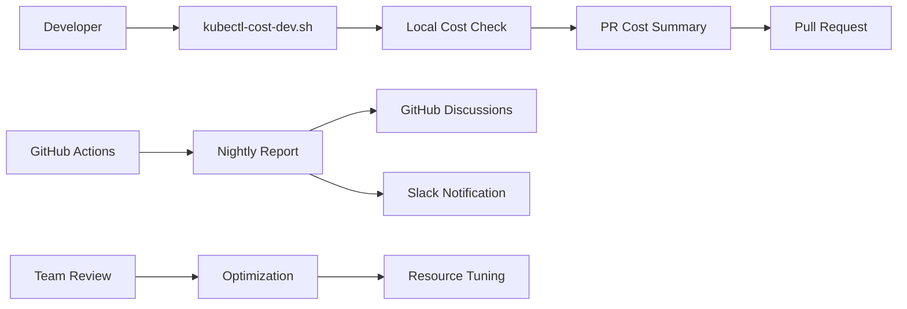

# kubectl-cost Integration for NeuroNews

Issue #339: kubectl-cost for devs + nightly report

This document describes the kubectl-cost integration that provides developers with immediate cost insights and generates nightly cost reports.

## 🎯 Overview

The kubectl-cost integration provides:
- **Developer Tool**: Immediate cost insights for PR screenshots and local development
- **Nightly Reports**: Automated cost analysis posted to GitHub Discussions and Slack
- **Pipeline-specific Analysis**: Cost breakdown by NeuroNews components
- **Optimization Recommendations**: Actionable cost reduction strategies

## 🛠 Developer Usage

### Quick Start
```bash
# Run the developer cost tool
./scripts/kubectl-cost-dev.sh

# Show pipeline-specific costs
./scripts/kubectl-cost-dev.sh pipelines

# Generate PR cost summary
./scripts/kubectl-cost-dev.sh pr
```

### Available Commands

| Command | Description | Use Case |
|---------|-------------|----------|
| `overview` | Quick cluster cost overview | Daily cost awareness |
| `pipelines` | Costs by NeuroNews components | Pipeline optimization |
| `workloads` | Top costly workloads | Resource investigation |
| `optimize` | Cost optimization tips | Performance tuning |
| `pr` | Generate PR cost summary | PR screenshots |
| `install` | Install kubectl-cost plugin | Setup |

### PR Cost Screenshots

For transparent cost impact in pull requests:

```bash
# Generate cost summary for PR
./scripts/kubectl-cost-dev.sh pr

# Copy content from pr-cost-summary.md to PR description
cat pr-cost-summary.md
```

Example PR cost section:
```markdown
## 💰 Cost Impact Analysis

### Before/After Comparison
- Current cluster cost: $45.23/day
- Projected impact: +$2.15/day (5% increase)
- Primary driver: New embedding service replicas

### Top Resource Consumers
1. embedding-service: 2.1 CPU, 4.2GB RAM
2. vector-search: 1.8 CPU, 3.1GB RAM
3. data-pipeline: 1.2 CPU, 2.8GB RAM

**💡 Cost Optimization Notes:**
- [x] Reviewed resource requests vs actual usage
- [x] Confirmed acceptable cost increase for feature value
- [x] Updated monitoring dashboards
```

## 🌙 Nightly Reports

### Automated Generation

The nightly cost report runs automatically at 2 AM UTC via GitHub Actions:

```yaml
# .github/workflows/kubectl-cost-nightly-report.yml
on:
  schedule:
    - cron: '0 2 * * *'  # Every night at 2 AM UTC
  workflow_dispatch:     # Manual triggering
```

### Report Contents

1. **Overall Cluster Cost**: Total daily/monthly spend
2. **Top 10 Costly Workloads**: By namespace (pipeline proxy)
3. **NeuroNews Pipeline Analysis**: Component-specific costs
4. **Resource Utilization**: Node and pod efficiency
5. **Optimization Recommendations**: Actionable cost reductions

### Delivery Channels

#### GitHub Discussions
- Posted to "Cost Reports" category (or available category)
- Searchable history of daily reports
- Community visibility for cost trends

#### Slack Integration
- Summary posted to #finops-team channel
- Quick access buttons to detailed report
- Real-time cost awareness

## 📊 Pipeline Cost Analysis

### NeuroNews Components

The system analyzes costs for specific NeuroNews pipelines:

```bash
# Data ingestion pipeline
kubectl cost --namespace data-pipeline

# Article processing
kubectl cost --namespace ingestion

# API services
kubectl cost --namespace api

# Embedding generation
kubectl cost --namespace embedding

# Vector search
kubectl cost --namespace vector-search

# Monitoring stack
kubectl cost --namespace monitoring
```

### Cost Grouping Strategy

Since kubectl-cost doesn't natively support pipeline grouping, we use:
- **Namespace-based grouping**: Each pipeline component in separate namespace
- **Label-based filtering**: Pipeline labels for workload identification
- **Controller analysis**: Cost by deployment, job, statefulset types

## 🔧 Installation & Setup

### Prerequisites

1. **Kubernetes cluster** with OpenCost deployed
2. **kubectl** configured with cluster access
3. **krew plugin manager** (auto-installed by scripts)

### Manual Installation

```bash
# Install krew plugin manager
(
  set -x; cd "$(mktemp -d)" &&
  OS="$(uname | tr '[:upper:]' '[:lower:]')" &&
  ARCH="$(uname -m | sed -e 's/x86_64/amd64/' -e 's/\(arm\)\(64\)\?.*/\1\2/' -e 's/aarch64$/arm64/')" &&
  KREW="krew-${OS}_${ARCH}" &&
  curl -fsSLO "https://github.com/kubernetes-sigs/krew/releases/latest/download/${KREW}.tar.gz" &&
  tar zxvf "${KREW}.tar.gz" &&
  ./"${KREW}" install krew
)

# Add krew to PATH
export PATH="${KREW_ROOT:-$HOME/.krew}/bin:$PATH"

# Install kubectl-cost plugin
kubectl krew update
kubectl krew install cost

# Verify installation
kubectl cost --help
```

### GitHub Actions Configuration

Required secrets for nightly reports:

```bash
# Kubernetes access
KUBECONFIG_CONTENT=<base64-encoded-kubeconfig>

# Slack integration (optional)
SLACK_WEBHOOK_URL_FINOPS=<slack-webhook-url>
```

## 📈 Cost Optimization Workflows

### Daily Developer Workflow

1. **Morning Check**: Run `./scripts/kubectl-cost-dev.sh` for overnight changes
2. **Pre-PR**: Generate cost summary with `kubectl-cost-dev.sh pr`
3. **Post-deployment**: Verify cost impact with `kubectl-cost-dev.sh pipelines`

### Weekly Team Review

1. **Review nightly reports** in GitHub Discussions
2. **Analyze cost trends** using FinOps dashboard
3. **Identify optimization opportunities** from recommendations
4. **Plan resource adjustments** based on utilization data

### Monthly Optimization

1. **Deep-dive analysis** using historical reports
2. **Resource right-sizing** based on efficiency metrics
3. **Pipeline optimization** for high-cost components
4. **Budget planning** using trend projections

## 🔍 Troubleshooting

### Common Issues

#### "Cost data not available"
```bash
# Check OpenCost deployment
kubectl get pods -n opencost

# Verify OpenCost metrics
kubectl port-forward -n opencost service/opencost 9003:9003
curl http://localhost:9003/metrics
```

#### "kubectl-cost command not found"
```bash
# Reinstall plugin
./scripts/kubectl-cost-dev.sh install

# Check krew path
echo $PATH | grep krew
```

#### "GitHub Discussions post failed"
- Ensure Discussions are enabled in repository settings
- Check GITHUB_TOKEN permissions include discussions

### Data Accuracy

#### Cost Data Delay
- OpenCost typically requires 10-15 minutes to collect initial data
- Historical cost accuracy improves over 24-48 hours
- Use trends rather than absolute values for recent deployments

#### Missing Namespaces
- Ensure workloads are deployed to expected namespaces
- Check namespace labels for pipeline identification
- Verify OpenCost has access to all namespaces

## 📋 Integration Points

### Existing FinOps Stack

The kubectl-cost integration complements existing FinOps tools:

- **Prometheus Alerts**: Budget threshold monitoring
- **Grafana Dashboards**: Visual cost trends and analytics
- **Unit Economics**: Cost per article/query tracking
- **Alertmanager**: Cost drift notifications

### Development Workflow



## 🔗 References

- **kubectl-cost Plugin**: https://opencost.io/docs/integrations/kubectl-cost/
- **OpenCost Documentation**: https://opencost.io/docs/
- **Krew Plugin Manager**: https://krew.sigs.k8s.io/
- **GitHub Discussions API**: https://docs.github.com/en/graphql/guides/using-the-graphql-api-for-discussions
- **FinOps Dashboard**: http://grafana:3000/d/neuronews-finops/
- **Budget Alerts Runbook**: docs/runbooks/finops-budget-alerts.md

## 📞 Support

- **Platform Team**: #platform-team
- **FinOps Team**: #finops-team  
- **Cost Issues**: Use kubectl-cost-dev.sh troubleshooting
- **Alert Issues**: Check FinOps runbook for budget alerts
