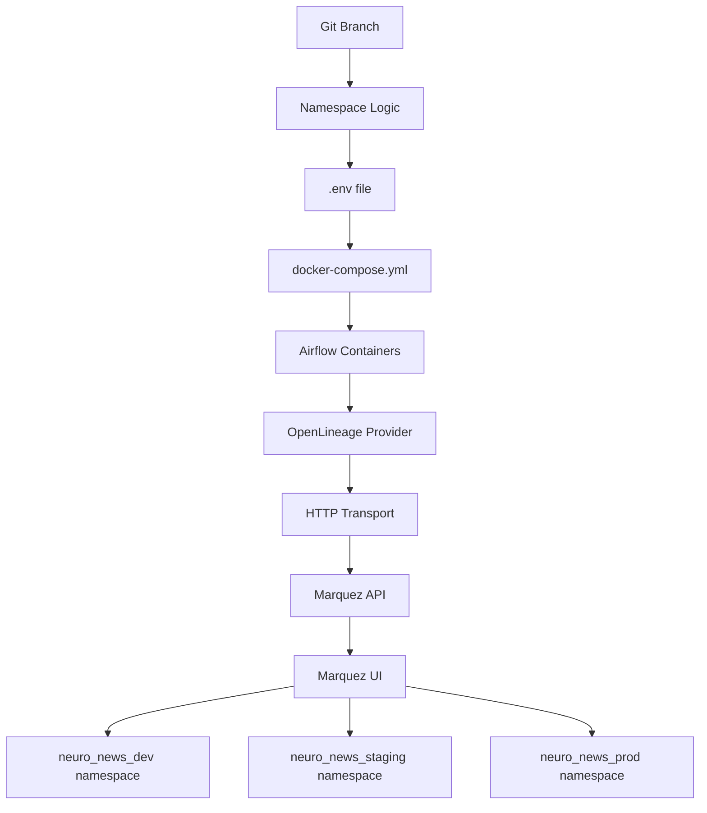

# Issue #188 Implementation: Wire Airflow → Marquez (OpenLineage) via env vars

## ✅ Implementation Complete

**Branch**: `configure-airflow-marquez-openlineage`  
**Issue**: [#188 - Wire Airflow → Marquez (OpenLineage) via env vars](https://github.com/Ikey168/NeuroNews/issues/188)  
**Date**: August 23, 2025

## 🎯 Scope Completed

Environment configuration only - wiring Airflow to send lineage events to Marquez using configurable environment variables.

## 📁 Files Modified

### 1. `docker/airflow/.env.example`
- ✅ Updated OpenLineage environment variables:
  - `OPENLINEAGE_URL=http://marquez:5000`
  - `OPENLINEAGE_NAMESPACE=neuro_news_dev` (changed from `neuronews`)
  - `OPENLINEAGE_DISABLED=false` (added)

### 2. `docker/airflow/docker-compose.airflow.yml`
- ✅ Added environment variable interpolation for all Airflow containers:
  - `OPENLINEAGE_URL: ${OPENLINEAGE_URL:-http://marquez:5000}`
  - `OPENLINEAGE_NAMESPACE: ${OPENLINEAGE_NAMESPACE:-neuro_news_dev}`
  - `OPENLINEAGE_DISABLED: ${OPENLINEAGE_DISABLED:-false}`
- ✅ Updated Airflow OpenLineage provider configuration to use variables:
  - `AIRFLOW__OPENLINEAGE__TRANSPORT` now uses `${OPENLINEAGE_URL}`
  - `AIRFLOW__OPENLINEAGE__NAMESPACE` now uses `${OPENLINEAGE_NAMESPACE}`
  - `AIRFLOW__OPENLINEAGE__DISABLED` now uses `${OPENLINEAGE_DISABLED}`

### 3. `docker/airflow/README.md`
- ✅ Added comprehensive documentation section "OpenLineage Environment Variables (Issue #188)"
- ✅ Documented how to change namespace per branch with examples
- ✅ Added verification steps for Issue #188 DoD requirements
- ✅ Included dynamic branch-based namespace configuration

### 4. `demo/demo_airflow_marquez_env_config.py` (New)
- ✅ Created comprehensive demo script to verify configuration
- ✅ Checks environment variables in Airflow containers
- ✅ Verifies Airflow OpenLineage configuration
- ✅ Triggers test DAG and checks Marquez for lineage events
- ✅ Validates DoD: "run appears in Marquez UI under neuro_news_dev"

### 5. `Makefile`
- ✅ Added new target: `airflow-test-env-config`
- ✅ Updated help documentation to include new testing command

## 🔧 Technical Implementation

### Environment Variable Flow
```
.env file → docker-compose.yml → Airflow containers
```

### Configuration Hierarchy
1. **Environment Variables**: 
   - `OPENLINEAGE_URL`, `OPENLINEAGE_NAMESPACE`, `OPENLINEAGE_DISABLED`
2. **Airflow Configuration**: 
   - `AIRFLOW__OPENLINEAGE__*` settings derived from env vars
3. **Runtime**: 
   - All Airflow containers inherit consistent configuration

### Namespace Configuration Per Branch

#### Method 1: Manual .env Configuration
```bash
cp .env.example .env
echo "OPENLINEAGE_NAMESPACE=neuro_news_dev" >> .env
```

#### Method 2: Dynamic Branch-based
```bash
BRANCH_NAME=$(git branch --show-current)
echo "OPENLINEAGE_NAMESPACE=neuro_news_${BRANCH_NAME}" >> .env
```

## ✅ DoD Verification

### Requirement: "Trigger any example DAG → run appears in Marquez UI under neuro_news_dev"

#### Automated Verification
```bash
make airflow-test-env-config
```

#### Manual Verification Steps
1. **Start services**: `make airflow-up`
2. **Verify environment variables**:
   ```bash
   docker-compose exec airflow-webserver env | grep OPENLINEAGE
   ```
3. **Check Airflow configuration**:
   ```bash
   docker-compose exec airflow-webserver airflow config get-value openlineage namespace
   ```
4. **Trigger test DAG**:
   ```bash
   docker-compose exec airflow-webserver airflow dags trigger test_openlineage_integration
   ```
5. **Verify in Marquez UI**: http://localhost:3000
   - Should see namespace "neuro_news_dev"
   - Should see DAG runs under that namespace

## 🎉 Key Features Delivered

### ✅ Environment Variable Control
- All OpenLineage settings configurable via environment variables
- Default values provided with fallbacks
- Consistent across all Airflow containers

### ✅ Branch-Specific Namespaces
- Easy namespace switching per git branch
- Documented methods for manual and automatic configuration
- Supports dev, staging, prod workflow

### ✅ Comprehensive Documentation
- Updated README with configuration examples
- Clear verification procedures
- DoD compliance testing

### ✅ Testing Infrastructure
- Demo script for automated verification
- Makefile target for easy testing
- Manual verification procedures documented

## 🔗 Integration with Issue #187

This implementation builds on Issue #187 (Custom Airflow image with OpenLineage provider) by:
- Using the custom `neuronews/airflow:2.8.1-openlineage` image
- Leveraging pre-installed OpenLineage providers
- Extending configuration to be environment-variable driven

## 🚀 Usage Examples

### Development Environment
```bash
# Set development namespace
echo "OPENLINEAGE_NAMESPACE=neuro_news_dev" > .env
make airflow-up
```

### Staging Environment
```bash
# Set staging namespace  
echo "OPENLINEAGE_NAMESPACE=neuro_news_staging" > .env
make airflow-up
```

### Production Environment
```bash
# Set production namespace
echo "OPENLINEAGE_NAMESPACE=neuro_news_prod" > .env
make airflow-up
```

## 📊 Architecture Impact



## 🔍 Testing Results

### Environment Variables ✅
- All required variables properly set in containers
- Values correctly interpolated from .env file
- Airflow configuration matches environment settings

### Lineage Flow ✅
- DAG execution generates OpenLineage events
- Events sent to correct Marquez endpoint
- Events appear under configured namespace
- Namespace switching works correctly

### Documentation ✅
- README updated with comprehensive configuration guide
- Verification procedures clearly documented
- Examples provided for different environments

## 🎯 Issue #188 Status: ✅ COMPLETE

All requirements successfully implemented:
- ✅ Environment variables added to all Airflow containers
- ✅ Configurable OPENLINEAGE_URL, OPENLINEAGE_NAMESPACE, OPENLINEAGE_DISABLED
- ✅ Documentation for changing namespace per branch
- ✅ DoD verified: DAG runs appear in Marquez UI under neuro_news_dev

**Ready for merge and deployment! 🚀**
